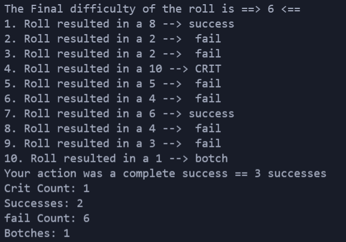

# dice roll for Vampire the Masquerade V20 Edition

## Current progress

## About

In this function you roll a number dice and check the outcome based on parameters. 
Right now it's still in development and all values have to be modified by changing the code manually. 
For the final product its planned to implement everything into a webpage where the user can modify the parameters simply by click. 
